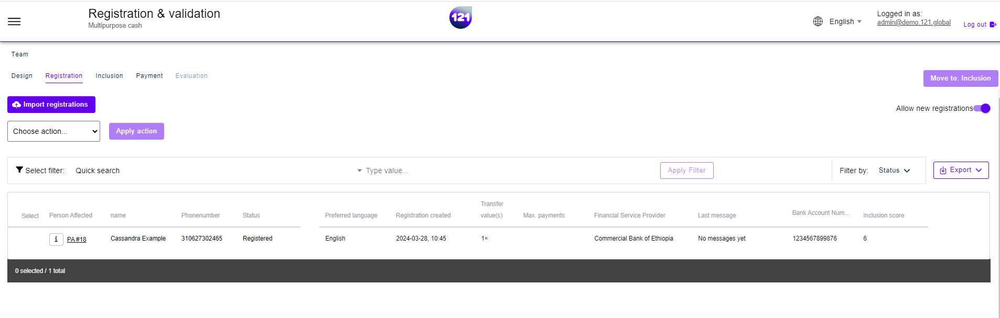

!!! info "This section explains"
    How to use the Registration page

The registration page enables to review the registered beneficiaries details before you include them into the program to start receiving cash assistance.
Note that Beneficiaries are named as People Affected (PA) in 121 platform.

### **Overview of registered PA**

Oversee all registred People Affected (beneficiaries). This is the initial phase of the program validation process. People Affected status is shown as "Registered" and will remain as it until the CVA manager or officer include (validated) into, or reject (rejected) the PA from the program.

Once your validation process is completed, the Registration page will show an [empty table.](../ProgramOverview/registration-list-empty.md)

### **Import a registration list**

Registration of PAs in 121 platform can be done either:

- **Manually**, by importing a registration list from an excel file (.CSV format). Learn more on the [registration import list page](../ProgramOverview/registration-import-list.mdprogramoverview)
- **Automatically**, by integrating your KOBO form or equivalent registration form App to directly upload your registration into 121 platform. Learn more on the [automatic import of registration page](../ProgramOverview/registration-automatic-import-kobo.md)

### **Review and Process registered PA's details**

Your validation process may include to review the beneficiaries'details before you validate and include the beneficiary into the program to start receiving cash assistance.
Follow the instructions on how to :

- Review and edit data in PA profile, [here](../programoverview/registration-deduplication.md)
- Include a PA in a program, [here](../programoverview/registration-validate-pa.md)
- Reject a PA from a program, [here](../ProgramOverview/registration-reject-pa.md)

### **Deduplicate registration**

Check for duplicates in the registration list before moving the People Affected towards the inclusion phase of your program. This validation process will prevent double payments, but also significantly reduce fraud risks. In case you use both automatic and manual upload of registration list, we strongly recommend including the deduplication phase in your validation process. 

Follow the instructions on the [Deduplication page](../programoverview/registration-deduplication.md)

!!! Important "Who can perform actions in this page ?"
    Program Manager, Cva Officer and Cva Manager can perform actions and view this page. 
    Additional users may be granted only View permission on this page. Learn more about Users & Roles [here](../general/users-permissions.md)

Need further assistance ? Contact your dedicated Account Manager or reach our <a href="mailto:support@121.global">support team via email</a>.