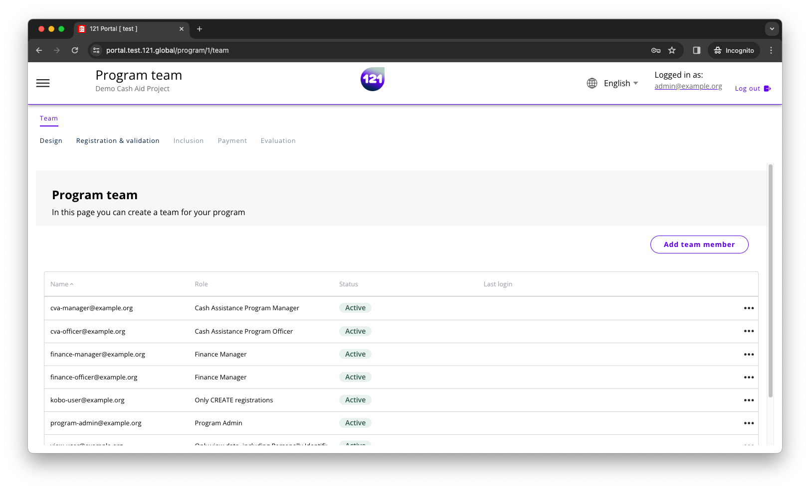
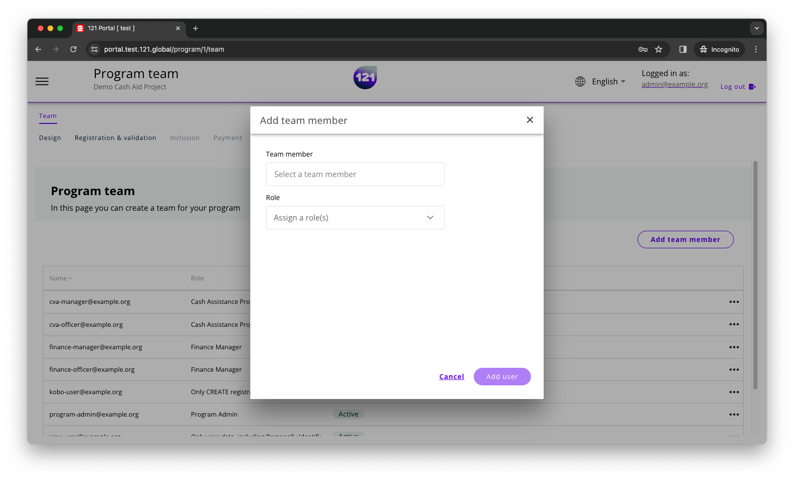

!!! info "This section explains"
    How to add team members to your program

### Adding team members

!!! warning "Permission required"
    Per default, Admin and CVA manager can add and delete team members, and assign them a role into a program team. If you would like to add this role to your instance, contact your dedicated account manager or support team via <a href="mailto:support@121.global">this email</a>

Open your program, so that you can see this screen:

Click on the page `Team` on the top left, then click on the `Add team member` button on the top right:

In the pop-up window, search for the username of the person you want to add to your programme, assign one or more role(s) and click the `add user` button:

Save your changes. The user will be automatically added into the program team.

!!! question "Can't find the user?"
    If you can't find the user that you want to add to the program, they need to be <a href="../add-users">added to the 121 platform first</a>

!!! warning "This user is already a team member"
    If you get an error message "This user is already a team member", they have already been added to the team. Do you want to change their roles? Follow the <a href="../remove-team-members-program">instructions in this page.</a>
