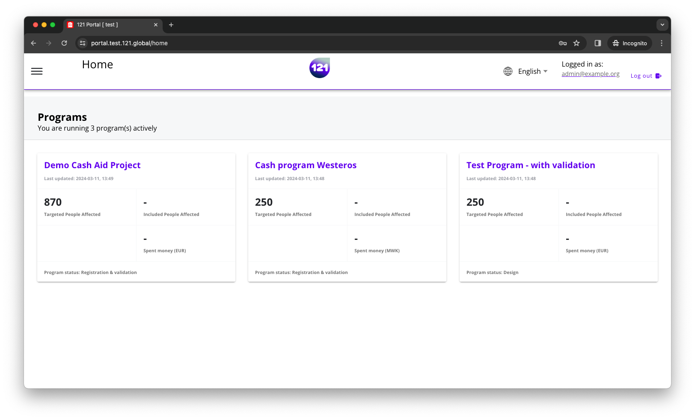
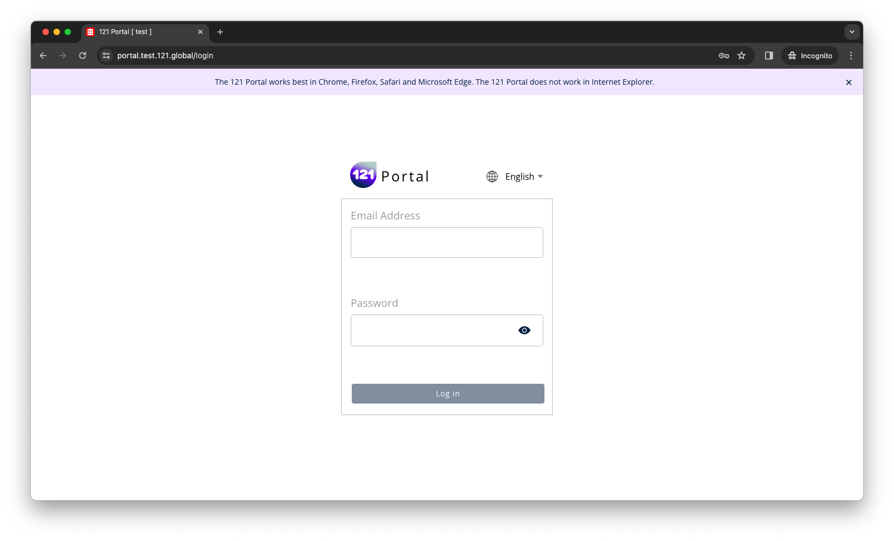

!!! info "This section explains"
    How to change the language

### Change the language

You can change the language in the top right corner of the screen. If you use arabic, the language switcher is on the left.

At login, you can change the language by clicking the current language and changing it to your desired language.

