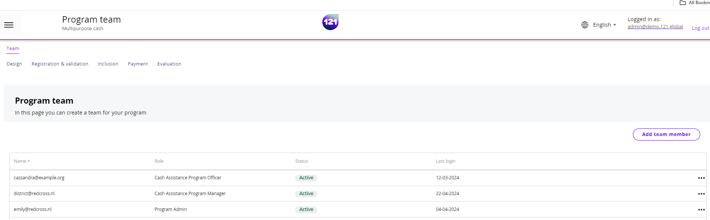
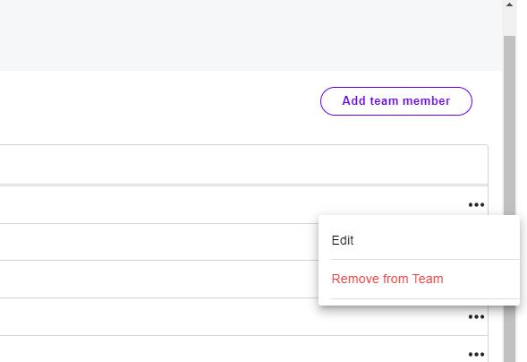
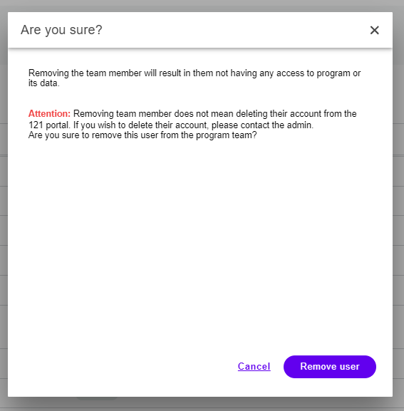

!!! info "This section explains"
    How to remove a team members from a program

In the team page of your program, you can see the list of team members currently added into your program. If you have the permission, you can add new users, assign and edit their roles, and remove them from the team. In this page, we explain how to remove a team members from a program.

- Enter the specific program, go to Team page.
- On the right of the team member line, click on the 3 dots:material-dots-horizontal:

- Click on Remove team member. A pop-window will warn your action before confirming. 
- Click on Remove user to confirm. The user is removed from the team.

!!! info "add users to a program"
    To add team members to a program, you can follow the instructions [here](../add-team-members)

!!! warning "A team member was removed by mistake"
    Did you remove a team member by mistake? Do not worry, the history and logs remain unchanged. If you have the permission, you can add the team member back to the team. If not, contact your 121 admin or our support team.
