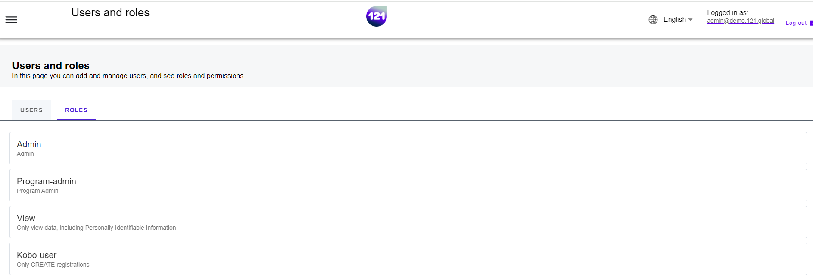

!!! info "This section explains"
    Overview of registered users and roles into 121 platform

The users page provides the list of registered user accounts and available roles in your 121 instance.

### Roles and Users page

The role and users page is accessible only by 121 platform **Admin users**. 

- In **Home page**, Click on the menu icon :material-menu: on the top left.
- Select **Users**.
- The left tab **Users** shows the list of registered users in your instance.
- The right tab **Roles** shows the list of available roles in your instance.

### Standard 121 user roles

No single user can take all actions in the 121 platform. The 121 platform follows **role-based segregation of duties**, which improves task **accountability**. For example, users with a CVA profile will not be able to make payments but are able to make updates to beneficiary data. Users with a finance profile can make payments, but are not able to update beneficiaries’ personal information. The following standard roles are configured in the 121 platform.

| Type                                         | Description                                                     |
| :----------                                  | :----------------------|
| **Program Admin**                            | Program Administrator, responsible for overall program management |
| **Finance Officer**                          | Officer for Finance operations  |
| **Finance Manager**                          | Manager for Finance operations, payment instructions   |
| **Cva Officer**                              | Officer for Cash and Voucher Assistance    |
| **Cva Manager**                              | Manager for Cash and Voucher Assistance   |
| **View**                                     | Portal Users who are allowed to view only and cannot perform actions   |
| **Kobo user**                                | Users who interact with KOBO, registering PA with KOBO form   |

!!! info "Additional roles"
    Additional roles can be configured based on request. Contact your dedicated Account Manager reach out to our <a href="mailto:support@121.global">support team via email</a>.

!!! note "Permissions"
    Find a description of role-based permissions [on this page](../general/table-description-role-permissions.md).

Need further assistance ? Contact your dedicated Account Manager or reach our <a href="mailto:support@121.global">support team via email</a>.