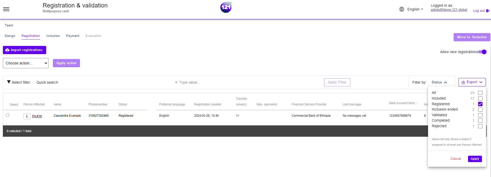

!!! info "This section explains"
    How to check the registration list status
    

Registration can be empty for the following reasons :

### **No new registration imported**

There is no new registration since last validation round. 
The table will show "No data"

### **No Internet Connexion**

In case you are using KOBO Toolbox form or alternative registration form App, the list may still need to be updated. 
Although the registration tool can be used offline, an internet connexion is required to start importing the registration list to 121 platform. 

To start importing the registration list: 

- Connect to an internet network. 
- Start the upload with KOBO form.
- Once done, refresh the registration page in your program.

### **Filters apply to the list**

Filters may be applied to the list. 

- Check the filter and search barre are empty. Delete any entry, click on Apply filter.
- Then, Check the selected criteria (right corner) on filter "by Status" and select "Registered".

!!! warning "Blank page"
    In case the page is fully blank and do not show the registration column, there may be a technical issue with the link connecting with your KOBO form.
    Please contact your dedicated Account Manager or our <a href="mailto:support@121.global">support team</a> to help fixing the issue.

Need further assistance ? Contact your dedicated Account Manager or reach our <a href="mailto:support@121.global">support team via email</a>.